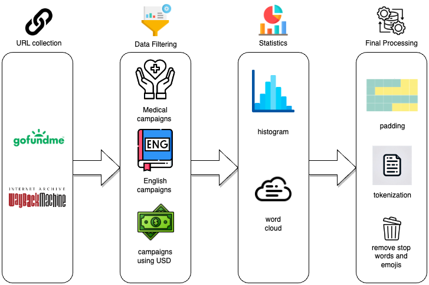
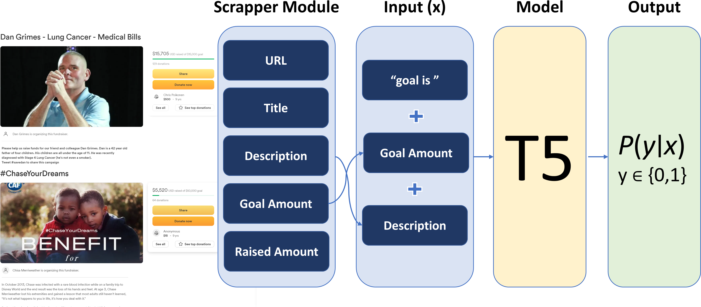

# FundSeer

## Overview
This repository contains the code and materials for our final project in the Natural Language Processing (NLP) course. The project focuses on predicting the success of medical crowdfunding campaigns using Natural Language Processing tools. The primary objective is to develop a model that can identify the likelihood of a campaign achieving its financial goal based on its narrative and other relevant features.

## Motivation and Goal
Access to healthcare is universally acknowledged as a fundamental human right. However, financial constraints often obstruct timely medical interventions, creating a critical gap in healthcare accessibility. In response to this challenge, crowdfunding platforms have emerged as innovative avenues for individuals to secure necessary funds. This paper presents a comprehensive study focusing on the pivotal role of campaign narratives in influencing the success of medical crowdfunding initiatives. 

Our primary objective is to predict the probability of success for medical crowdfunding campaigns. In this context, a campaign is considered successful if the amount raised meets or surpasses its stated financial goal. Early identification of unsuccessful campaigns enables strategic interventions, such as narrative enhancement or intensified marketing efforts, to augment their likelihood of success. Machine learning is particularly apt for this task because it can help discern complex patterns in large datasets, which might not be immediately apparent through traditional analysis. 

Our architecture employs a scrapper module to extract key metadata from medical crowdfunding campaigns, which are then fed into our main model to calculate the probability of campaign success. An illustration of our proposed system is shown below. 


## Data Processing Pipeline



## Project Diagram

> The input variable, denoted
as $x$, for both models consisted of the goal and campaign narrative combined, aiming to predict the
likelihood of a campaign being either successful or not, denoted as $p(y|x)$, where $y$ represents the
campaign class (1 for successful and 0 for unsuccessful). This relationship is visually depicted in the
following block diagram.



## Results

### Baseline Models
| Model                       | Accuracy | F1 Score | AUC   |
|-----------------------------|----------|----------|-------|
| Shallow Neural Network (SNN) | 54.7%    | 62.8%    | 58.2% |
| Long Short-Term Memory (LSTM)| 60.3%    | 60.5%    | 64.2% |

### Main Models
| Model                   | Accuracy | F1 Score | AUC   |
|-------------------------|----------|----------|-------|
| ALBERT-base-end2end      | 70.7%    | 70.7%    | 78.7% |
| T5-small-clf             | 72.8%    | 71.6%    | 80.6% |
| T5-small-end2end         | 72.3%    | 71.3%    | 80.6% |
| T5-base-clf              | 71.8%    | 71.2%    | 79.9% |


## Project Structure

The repository is organized into two main folders:

### 1. Scrapper
This folder contains all the details and code related to the web scraping process. The scraper module is designed to extract key metadata, including titles, descriptions, goal amounts, and raised amounts from medical crowdfunding campaigns hosted on GoFundMe platform, which is then used as input for our models.

### 2. Notebooks
This folder includes Jupyter notebooks documenting the exploration and implementation of various models ranging from Shallow Neural Netwroks (SNN), LSTM, T5, ALBERT, and prompt engineering using GPT3.5.


## Getting Started
To begin using FundSeer, clone the repository and follow the setup instructions.

```
git clone https://github.com/ece1786-2023/FundSeer
cd FundSeer
```

## Future Work

- Explore the use of additional modalities such as images and metadata to enhance model performance.
- Conduct further experiments on the T5-base model with extended training durations to potentially improve performance.

## Conclusion

Our project demonstrates the effectiveness of natural language processing models in predicting the success of medical crowdfunding campaigns. The combination of narrative analysis and financial data allows for accurate predictions, with our best model achieving an accuracy of 72.8%. The insights gained from the analysis can inform strategic interventions to enhance the success of crowdfunding initiatives in the healthcare domain.

Feel free to explore the provided code and notebooks for a detailed understanding of our methodology and findings. If you have any questions or feedback, please don't hesitate to reach out the authors. 


